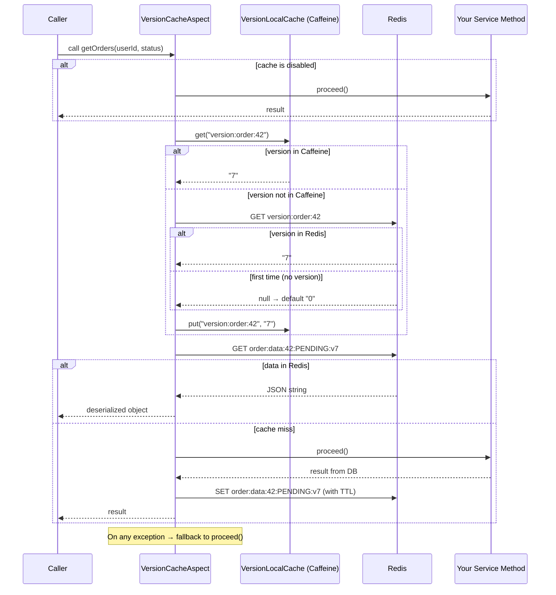
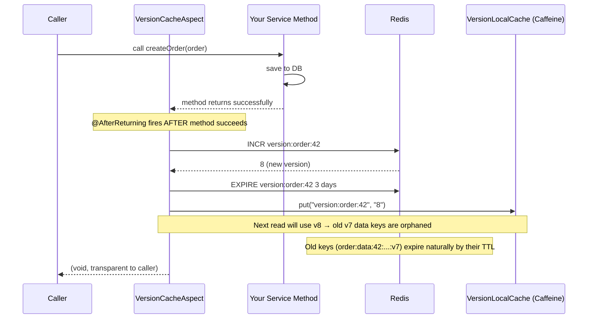

# Version Cache Spring Boot Starter

A Spring Boot starter that provides **version-based two-tier caching** using Redis and Caffeine. Instead of expiring cache entries directly, each cache namespace is associated with a version counter in Redis. When data changes, the version is bumped — making all previous data keys for that namespace unreachable without needing explicit key-by-key invalidation.

---

## Table of Contents

- [How It Works](#how-it-works)
- [Installation](#installation)
- [Quick Start](#quick-start)
- [Annotations Reference](#annotations-reference)
- [Configuration Reference](#configuration-reference)
- [Cache Key Schema](#cache-key-schema)
- [Architecture](#architecture)
- [Flow Diagrams](#flow-diagrams)
- [Advanced Usage](#advanced-usage)

---

## How It Works

```
┌──────────────────────────────────────────────────────────┐
│                     Your Application                      │
│                                                           │
│   @VersionCache  ──► Read Method  (returns cached data)   │
│   @BumpVersion   ──► Write Method (increments version)    │
└────────────────────────┬─────────────────────────────────┘
                         │
          ┌──────────────▼──────────────┐
          │       VersionCacheAspect    │  (AOP interceptor)
          └──────┬──────────────┬───────┘
                 │              │
    ┌────────────▼───┐    ┌─────▼──────────────┐
    │ VersionLocal   │    │    Redis            │
    │ Cache          │    │  - version key      │
    │ (Caffeine)     │    │  - data key         │
    │ stores version │    │                     │
    └────────────────┘    └─────────────────────┘
```

**The key insight:** data keys embed the current version (`...v3`). Bumping the version to `4` makes old keys (`...v3`) effectively orphaned — they expire naturally by TTL. No need to track or delete individual cache entries.

---

## Installation

Install to your local Maven repository:

```bash
git clone https://github.com/your-org/version-cache-spring-boot-starter.git
cd version-cache-spring-boot-starter
mvn install
```

Add the dependency to your application's `pom.xml`:

```xml
<dependency>
    <groupId>com.ntdat</groupId>
    <artifactId>version-cache-spring-boot-starter</artifactId>
    <version>1.0.0</version>
</dependency>
```

**Prerequisites in your application:**
- A configured `RedisConnectionFactory` bean (e.g., via `spring-boot-starter-data-redis`)
- An `ObjectMapper` bean (provided automatically by `spring-boot-starter-web`)

---

## Quick Start

### 1. Configure Redis in your application

```yaml
spring:
  redis:
    host: localhost
    port: 6379
```

### 2. Annotate your service methods

```java
@Service
public class OrderService {

    @VersionCache(entity = "order", userId = "#userId", extraKeys = {"#status"}, ttl = 5, unit = TimeUnit.MINUTES)
    public List<Order> getOrders(Long userId, String status) {
        return orderRepository.findByUserIdAndStatus(userId, status);
    }

    @BumpVersion(entity = "order", userId = "#order.userId")
    public Order createOrder(Order order) {
        return orderRepository.save(order);
    }

    @BumpVersion(entity = "order", userId = "#userId")
    public void deleteOrder(Long userId, Long orderId) {
        orderRepository.deleteById(orderId);
    }
}
```

### 3. (Optional) Tune cache settings

```yaml
version-cache:
  enabled: true
  enable-logging: true
  local-ttl-seconds: 30
  max-size: 50000
  version-key-ttl-days: 3
```

That's it. No `@EnableVersionCache` or additional configuration needed — the starter auto-configures everything.

---

## Annotations Reference

### `@VersionCache`

Applied to **read methods**. Intercepts the method call and returns cached data if available.

| Attribute | Type | Required | Default | Description |
|---|---|---|---|---|
| `entity` | `String` | Yes | — | Cache namespace (e.g., `"order"`, `"product"`) |
| `userId` | `String` | Yes | — | SpEL expression resolving to the user/tenant identifier |
| `extraKeys` | `String[]` | No | `{}` | Additional SpEL expressions to differentiate entries within the same entity+user |
| `ttl` | `long` | No | `1` | TTL for the data entry in Redis |
| `unit` | `TimeUnit` | No | `MINUTES` | Time unit for `ttl` |

**`userId` SpEL examples:**

```java
// Direct parameter
@VersionCache(entity = "order", userId = "#userId")
public List<Order> getOrders(Long userId) { ... }

// Nested field
@VersionCache(entity = "order", userId = "#request.userId")
public List<Order> getOrders(OrderRequest request) { ... }

// Literal string (shared cache for all users — use with caution)
@VersionCache(entity = "product", userId = "'global'")
public List<Product> getAllProducts() { ... }
```

**`extraKeys` examples:**

```java
// Cache is split by status
@VersionCache(entity = "order", userId = "#userId", extraKeys = {"#status"})
public List<Order> getOrdersByStatus(Long userId, String status) { ... }

// Cache is split by page and size
@VersionCache(entity = "order", userId = "#userId", extraKeys = {"#page", "#size"})
public Page<Order> getOrdersPaged(Long userId, int page, int size) { ... }

// Multiple dimensions
@VersionCache(entity = "order", userId = "#userId", extraKeys = {"#status", "#fromDate"})
public List<Order> getOrders(Long userId, String status, LocalDate fromDate) { ... }
```

---

### `@BumpVersion`

Applied to **write methods** (create, update, delete). Runs **after** the method returns successfully, incrementing the version counter in Redis.

| Attribute | Type | Required | Description |
|---|---|---|---|
| `entity` | `String` | Yes | Must match the `entity` in the corresponding `@VersionCache` |
| `userId` | `String` | Yes | SpEL expression — must resolve to the same user/tenant as the read annotation |

```java
// Bumps version for the specific user who owns the order
@BumpVersion(entity = "order", userId = "#order.userId")
public Order updateOrder(Order order) { ... }

// You can bump multiple entities by annotating multiple times (requires meta-annotation or manual)
@BumpVersion(entity = "order", userId = "#userId")
public void clearUserData(Long userId) { ... }
```

> **Important:** `@BumpVersion` only fires if the method completes **without throwing an exception** (`@AfterReturning` semantics). If the method throws, no version bump occurs.

---

## Configuration Reference

All properties are under the `version-cache` prefix:

```yaml
version-cache:
  enabled: true              # Kill switch. Set to false to bypass all caching.
  enable-logging: true       # Log cache hits/misses/bumps at INFO level.
  local-ttl-seconds: 30      # How long version strings stay in Caffeine (+ 0-9s jitter).
  max-size: 50000            # Max number of entries in the Caffeine cache.
  version-key-ttl-days: 3   # How long version keys survive in Redis after last bump.
```

**Jitter on local TTL:** `VersionLocalCache` adds a random `0–9` second offset to `local-ttl-seconds` to prevent cache stampede when multiple instances restart simultaneously.

---

## Cache Key Schema

```
Version key:  version:{entity}:{userId}
              e.g. version:order:42

Data key:     {entity}:data:{userId}:{extraKey}:v{version}
              e.g. order:data:42:PENDING_2024-01-01:v7
              e.g. order:data:42:default:v3       (no extraKeys)
```

---

## Architecture

```
┌─────────────────────────────────────────────────────────────────────┐
│                        Spring Application                            │
│                                                                      │
│  ┌──────────────┐    ┌──────────────────────────────────────────┐   │
│  │  Your Service│    │           VersionCacheAspect              │   │
│  │              │───►│                                           │   │
│  │ @VersionCache│    │  1. Resolve userId/extraKeys via SpEL     │   │
│  │ @BumpVersion │    │  2. Build version key                     │   │
│  └──────────────┘    │  3. Read/write version (Caffeine→Redis)   │   │
│                      │  4. Read/write data (Redis)               │   │
│                      │  5. Fallback on exception                 │   │
│                      └──────────┬──────────────────┬────────────┘   │
│                                 │                  │                 │
│                    ┌────────────▼───┐    ┌─────────▼──────────┐     │
│                    │VersionLocalCache│   │  StringRedisTemplate│     │
│                    │  (Caffeine)    │    │                     │     │
│                    │                │    │  version:order:42   │     │
│                    │ version:order:42│   │  order:data:42:..   │     │
│                    │  → "7"         │    │                     │     │
│                    └───────────────┘    └─────────────────────┘     │
│                                                                      │
│  ┌──────────────────────────────────────────────────────────────┐   │
│  │ VersionCacheAutoConfiguration                                 │   │
│  │   @EnableConfigurationProperties(VersionCacheProperties)      │   │
│  └──────────────────────────────────────────────────────────────┘   │
└─────────────────────────────────────────────────────────────────────┘
```

---

## Flow Diagrams

### Read Flow (`@VersionCache`)



---

### Write Flow (`@BumpVersion`)



---

### Version Invalidation Concept

```
Timeline ──────────────────────────────────────────────────►

  t=0   User 42 reads orders           → version=0, key=order:data:42:default:v0
  t=5   User 42 reads orders again     → Caffeine hit (version=0), key=order:data:42:default:v0 → Redis HIT
  t=10  User 42 creates a new order    → INCR → version becomes 1
  t=11  User 42 reads orders           → version=1 (from Caffeine/Redis), key=order:data:42:default:v1 → MISS → DB
        New result stored at           → order:data:42:default:v1
        Old key order:data:42:default:v0 is ORPHANED (expires by TTL)
```

---

## Advanced Usage

### Disabling cache at runtime

Set `version-cache.enabled=false` via environment variable or config refresh:

```bash
export VERSION_CACHE_ENABLED=false
```

All annotated methods will pass through directly to the real implementation.

### Using with multi-tenancy

`userId` can represent any partitioning dimension — it doesn't have to be a user:

```java
// Partition by tenant
@VersionCache(entity = "product", userId = "#tenantId")
public List<Product> getProducts(String tenantId) { ... }

// Partition by shop
@VersionCache(entity = "inventory", userId = "#shopId", extraKeys = {"#category"})
public List<Item> getInventory(Long shopId, String category) { ... }
```

### Combining with Spring's own caching

This starter does **not** conflict with `@Cacheable`/`@CacheEvict`. You can use both in the same application on different methods.

### Fallback behavior

If Redis is unavailable, `VersionCacheAspect` catches the exception, logs `[CACHE_FALLBACK]`, and proceeds to call the real method. Your application degrades gracefully — it becomes cache-less but fully functional.
