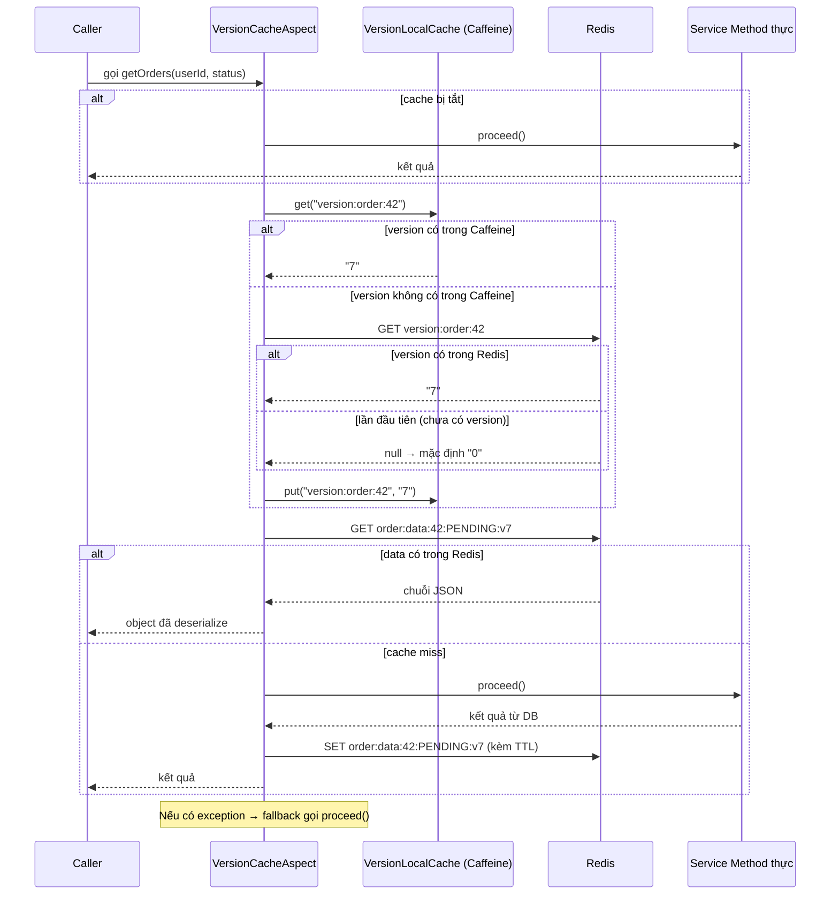
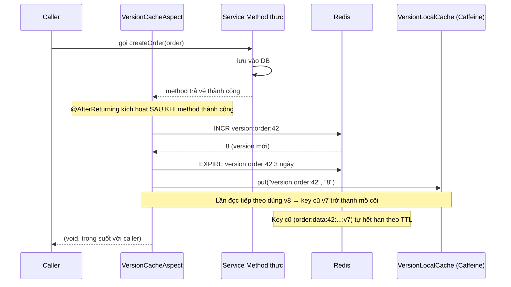

# Version Cache Spring Boot Starter

Spring Boot starter cung cấp **cơ chế cache hai tầng dựa trên version** sử dụng Redis và Caffeine. Thay vì xóa trực tiếp từng cache entry, mỗi namespace cache được gắn với một bộ đếm version trong Redis. Khi dữ liệu thay đổi, version được tăng lên — khiến tất cả data key cũ trở nên vô hiệu mà không cần xóa theo từng key.

---

## Mục lục

- [Cách hoạt động](#cách-hoạt-động)
- [Cài đặt](#cài-đặt)
- [Bắt đầu nhanh](#bắt-đầu-nhanh)
- [Tham chiếu Annotation](#tham-chiếu-annotation)
- [Tham chiếu Cấu hình](#tham-chiếu-cấu-hình)
- [Schema Cache Key](#schema-cache-key)
- [Kiến trúc](#kiến-trúc)
- [Flow Diagram](#flow-diagram)
- [Sử dụng nâng cao](#sử-dụng-nâng-cao)

---

## Cách hoạt động

```
┌──────────────────────────────────────────────────────────┐
│                   Ứng dụng của bạn                        │
│                                                           │
│   @VersionCache  ──► Read Method  (trả về data cache)    │
│   @BumpVersion   ──► Write Method (tăng version)         │
└────────────────────────┬─────────────────────────────────┘
                         │
          ┌──────────────▼──────────────┐
          │       VersionCacheAspect    │  (AOP interceptor)
          └──────┬──────────────┬───────┘
                 │              │
    ┌────────────▼───┐    ┌─────▼──────────────┐
    │ VersionLocal   │    │    Redis            │
    │ Cache          │    │  - version key      │
    │ (Caffeine)     │    │  - data key         │
    │ lưu version    │    │                     │
    └────────────────┘    └─────────────────────┘
```

**Ý tưởng cốt lõi:** Data key nhúng version hiện tại vào tên key (ví dụ `...v3`). Khi version tăng lên `4`, key cũ (`...v3`) trở thành "mồ côi" — tự nhiên hết hạn theo TTL. Không cần theo dõi hay xóa từng cache entry riêng lẻ.

---

## Cài đặt

Cài vào Maven repository local:

```bash
git clone https://github.com/your-org/version-cache-spring-boot-starter.git
cd version-cache-spring-boot-starter
mvn install
```

Thêm dependency vào `pom.xml` của ứng dụng:

```xml
<dependency>
    <groupId>com.ntdat</groupId>
    <artifactId>version-cache-spring-boot-starter</artifactId>
    <version>1.0.0</version>
</dependency>
```

**Yêu cầu trong ứng dụng của bạn:**
- Bean `RedisConnectionFactory` đã được cấu hình (ví dụ qua `spring-boot-starter-data-redis`)
- Bean `ObjectMapper` (được cung cấp tự động bởi `spring-boot-starter-web`)

---

## Bắt đầu nhanh

### 1. Cấu hình Redis trong ứng dụng

```yaml
spring:
  redis:
    host: localhost
    port: 6379
```

### 2. Gắn annotation vào các method service

```java
@Service
public class OrderService {

    @VersionCache(entity = "order", userId = "#userId", extraKeys = {"#status"}, ttl = 5, unit = TimeUnit.MINUTES)
    public List<Order> getOrders(Long userId, String status) {
        return orderRepository.findByUserIdAndStatus(userId, status);
    }

    @BumpVersion(entity = "order", userId = "#order.userId")
    public Order createOrder(Order order) {
        return orderRepository.save(order);
    }

    @BumpVersion(entity = "order", userId = "#userId")
    public void deleteOrder(Long userId, Long orderId) {
        orderRepository.deleteById(orderId);
    }
}
```

### 3. (Tuỳ chọn) Tinh chỉnh cấu hình

```yaml
version-cache:
  enabled: true
  enable-logging: true
  local-ttl-seconds: 30
  max-size: 50000
  version-key-ttl-days: 3
```

Chỉ vậy thôi. Không cần `@EnableVersionCache` hay cấu hình bổ sung — starter tự động cấu hình mọi thứ.

---

## Tham chiếu Annotation

### `@VersionCache`

Dùng cho **các method đọc dữ liệu**. Chặn lời gọi method và trả về dữ liệu từ cache nếu có.

| Thuộc tính | Kiểu | Bắt buộc | Mặc định | Mô tả |
|---|---|---|---|---|
| `entity` | `String` | Có | — | Namespace cache (ví dụ: `"order"`, `"product"`) |
| `userId` | `String` | Có | — | Biểu thức SpEL định danh user/tenant |
| `extraKeys` | `String[]` | Không | `{}` | Các biểu thức SpEL bổ sung để phân biệt entry trong cùng entity+user |
| `ttl` | `long` | Không | `1` | TTL cho data entry trong Redis |
| `unit` | `TimeUnit` | Không | `MINUTES` | Đơn vị thời gian cho `ttl` |

**Ví dụ SpEL cho `userId`:**

```java
// Tham số trực tiếp
@VersionCache(entity = "order", userId = "#userId")
public List<Order> getOrders(Long userId) { ... }

// Trường lồng nhau
@VersionCache(entity = "order", userId = "#request.userId")
public List<Order> getOrders(OrderRequest request) { ... }

// Literal string (cache chung cho tất cả user — dùng thận trọng)
@VersionCache(entity = "product", userId = "'global'")
public List<Product> getAllProducts() { ... }
```

**Ví dụ `extraKeys`:**

```java
// Cache phân tách theo status
@VersionCache(entity = "order", userId = "#userId", extraKeys = {"#status"})
public List<Order> getOrdersByStatus(Long userId, String status) { ... }

// Cache phân tách theo trang
@VersionCache(entity = "order", userId = "#userId", extraKeys = {"#page", "#size"})
public Page<Order> getOrdersPaged(Long userId, int page, int size) { ... }

// Nhiều chiều
@VersionCache(entity = "order", userId = "#userId", extraKeys = {"#status", "#fromDate"})
public List<Order> getOrders(Long userId, String status, LocalDate fromDate) { ... }
```

---

### `@BumpVersion`

Dùng cho **các method ghi dữ liệu** (tạo, cập nhật, xóa). Chạy **sau khi** method trả về thành công, tăng bộ đếm version trong Redis.

| Thuộc tính | Kiểu | Bắt buộc | Mô tả |
|---|---|---|---|
| `entity` | `String` | Có | Phải trùng với `entity` trong `@VersionCache` tương ứng |
| `userId` | `String` | Có | Biểu thức SpEL — phải resolve ra cùng user/tenant với annotation đọc |

```java
// Tăng version cho user sở hữu order
@BumpVersion(entity = "order", userId = "#order.userId")
public Order updateOrder(Order order) { ... }

@BumpVersion(entity = "order", userId = "#userId")
public void clearUserData(Long userId) { ... }
```

> **Quan trọng:** `@BumpVersion` chỉ kích hoạt khi method **không ném exception** (semantics `@AfterReturning`). Nếu method throw exception, version không tăng.

---

## Tham chiếu Cấu hình

Tất cả thuộc tính nằm dưới prefix `version-cache`:

```yaml
version-cache:
  enabled: true              # Kill switch. Set false để bỏ qua toàn bộ cache.
  enable-logging: true       # Log cache hit/miss/bump ở mức INFO.
  local-ttl-seconds: 30      # Thời gian version string tồn tại trong Caffeine (+ 0-9s jitter).
  max-size: 50000            # Số entry tối đa trong Caffeine cache.
  version-key-ttl-days: 3   # Thời gian version key tồn tại trong Redis sau lần bump cuối.
```

**Jitter trên local TTL:** `VersionLocalCache` thêm ngẫu nhiên `0–9` giây vào `local-ttl-seconds` để tránh cache stampede khi nhiều instance khởi động lại cùng lúc.

---

## Schema Cache Key

```
Version key:  version:{entity}:{userId}
              vd: version:order:42

Data key:     {entity}:data:{userId}:{extraKey}:v{version}
              vd: order:data:42:PENDING_2024-01-01:v7
              vd: order:data:42:default:v3       (không có extraKeys)
```

---

## Kiến trúc

```
┌─────────────────────────────────────────────────────────────────────┐
│                        Spring Application                            │
│                                                                      │
│  ┌──────────────┐    ┌──────────────────────────────────────────┐   │
│  │  Service của │    │           VersionCacheAspect              │   │
│  │     bạn      │───►│                                           │   │
│  │              │    │  1. Resolve userId/extraKeys qua SpEL     │   │
│  │ @VersionCache│    │  2. Build version key                     │   │
│  │ @BumpVersion │    │  3. Đọc/ghi version (Caffeine→Redis)      │   │
│  └──────────────┘    │  4. Đọc/ghi data (Redis)                  │   │
│                      │  5. Fallback khi có exception             │   │
│                      └──────────┬──────────────────┬────────────┘   │
│                                 │                  │                 │
│                    ┌────────────▼───┐    ┌─────────▼──────────┐     │
│                    │VersionLocalCache│   │  StringRedisTemplate│     │
│                    │  (Caffeine)    │    │                     │     │
│                    │                │    │  version:order:42   │     │
│                    │ version:order:42│   │  order:data:42:..   │     │
│                    │  → "7"         │    │                     │     │
│                    └───────────────┘    └─────────────────────┘     │
│                                                                      │
│  ┌──────────────────────────────────────────────────────────────┐   │
│  │ VersionCacheAutoConfiguration                                 │   │
│  │   @EnableConfigurationProperties(VersionCacheProperties)      │   │
│  └──────────────────────────────────────────────────────────────┘   │
└─────────────────────────────────────────────────────────────────────┘
```

---

## Flow Diagram

### Luồng đọc (`@VersionCache`)



---

### Luồng ghi (`@BumpVersion`)



---

### Concept Invalidation theo Version

```
Dòng thời gian ──────────────────────────────────────────────────►

  t=0   User 42 đọc orders           → version=0, key=order:data:42:default:v0
  t=5   User 42 đọc orders lại       → Caffeine hit (version=0), Redis HIT → trả về cache
  t=10  User 42 tạo order mới        → INCR → version thành 1
  t=11  User 42 đọc orders           → version=1 (từ Caffeine/Redis), key=order:data:42:default:v1 → MISS → gọi DB
        Kết quả mới lưu tại          → order:data:42:default:v1
        Key cũ order:data:42:default:v0 trở thành MỒ CÔI (tự hết hạn theo TTL)
```

---

## Sử dụng nâng cao

### Tắt cache lúc runtime

Đặt `version-cache.enabled=false` qua biến môi trường hoặc config refresh:

```bash
export VERSION_CACHE_ENABLED=false
```

Tất cả method có annotation sẽ truyền thẳng qua implementation thực.

### Dùng với multi-tenancy

`userId` có thể đại diện cho bất kỳ chiều phân vùng nào — không nhất thiết phải là user:

```java
// Phân vùng theo tenant
@VersionCache(entity = "product", userId = "#tenantId")
public List<Product> getProducts(String tenantId) { ... }

// Phân vùng theo shop
@VersionCache(entity = "inventory", userId = "#shopId", extraKeys = {"#category"})
public List<Item> getInventory(Long shopId, String category) { ... }
```

### Kết hợp với Spring cache thuần

Starter này **không xung đột** với `@Cacheable`/`@CacheEvict`. Bạn có thể dùng cả hai trong cùng ứng dụng cho các method khác nhau.

### Fallback khi Redis không khả dụng

Nếu Redis không khả dụng, `VersionCacheAspect` bắt exception, log `[CACHE_FALLBACK]`, và tiếp tục gọi method thực. Ứng dụng của bạn hoạt động bình thường — chỉ là không có cache — đảm bảo tính sẵn sàng cao.
